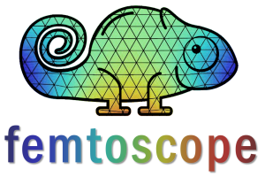
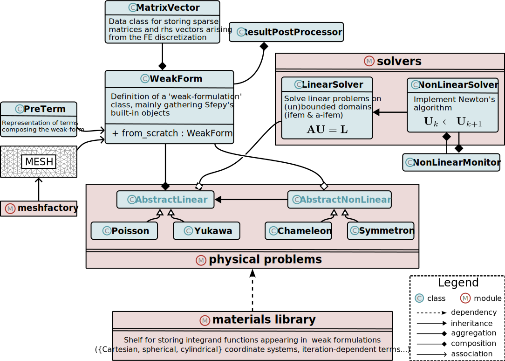

The *femtoscope* software was written as part of [Hugo Lévy's PhD thesis](https://theses.hal.science/tel-04789073v1/document) (2021-2024). This Python code can be used to investigate different models of modified gravity within complex geometries on unbounded domains.

## Conda virtual environment

It is recommended to run *femtoscope* on a dedicated virtual environment. The `femtoscope.yml` file can be used to automate the creation of a conda environment as follows:

1) Create the environment
	```console
	>> conda env create -f femtoscope.yml
	```
	Note that this process is likely to take several tens of minutes.
2) Activate the new environment
	```console
	>> conda activate femtoscope
	```
3) Verify that the new environment was installed correctly
	```console
    >> conda env list
	```
   and make sure femtoscope appears in the list.
   
**note**
The project uses Python >= 3.9

## Main dependencies

- Python >= 3.9
- meshio == 4.4.6 (read & write mesh files)
- numpy < 2 (sfepy is not yet compatible with numpy 2.x)
- pandas >= 1.5.3
- pyevtk (creation of `.vtk` files)
- pyvista (visualization of FEM results)
- scipy
- sfepy >= 2024.3 (FEM engine)
- pdoc >= 14.5.1 (patch against polyfill.io malicious CDN)
- gmsh == 4.11.1 (some features of *femtoscope* are broken in newer versions)
	
## Tree structure

```shell
├───data		# I/O files
│   ├───mesh
│   │   └───geo
│   ├───model
│   ├───result
│   └───tmp
│
├───doc
│
├───femtoscope
│   ├───core	# weak form representation & solvers
│   ├───display
│   ├───inout	# mesh & VTK generation
│   ├───misc
│   ├───physics	# Poisson & Chameleon classes	
│   ├───tests	# unit & integration tests
│
├───images
│
├───script		# Examples
│
└───tutorials	# hands-on notebooks
```

## UML Diagram



## Citing

If you would like to cite *femtoscope* in a paper or presentation, please use the following reference:
```
@article{hlevy:femtoscope,
	doi = {10.1103/PhysRevD.106.124021},
	url = {https://link.aps.org/doi/10.1103/PhysRevD.106.124021},
	author = {Lévy, Hugo and Bergé, Joël and Uzan, Jean-Philippe},
	title = {Solving nonlinear Klein-Gordon equations on unbounded domains via
	the Finite Element Method},
	month = {09},
	year = {2022}
}
```

## Generate documentation

The documentation is generated using pdoc by running the Python script "generate_documentation.py" located in the "script" directory. Additional information about *femtoscope* can be found in [Hugo Lévy's PhD thesis](https://theses.hal.science/tel-04789073v1/document), chapter 4.